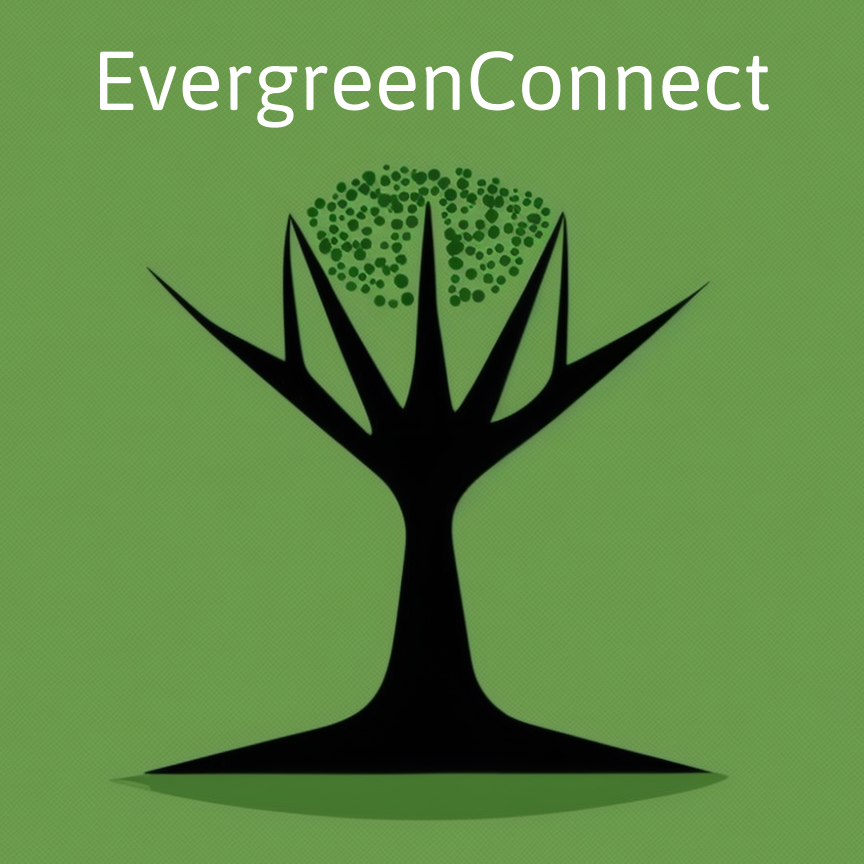
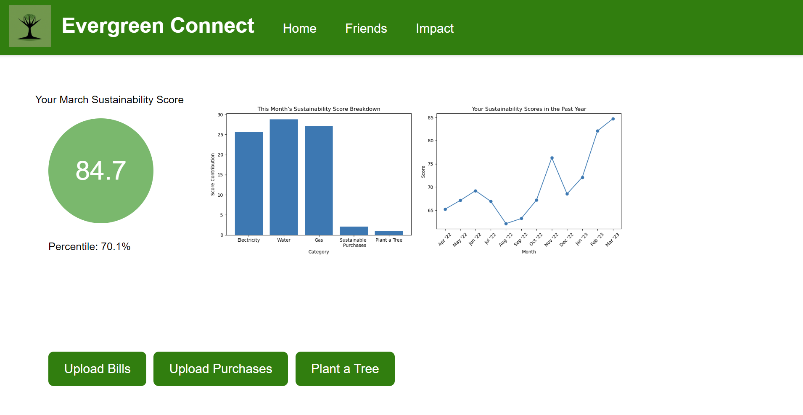
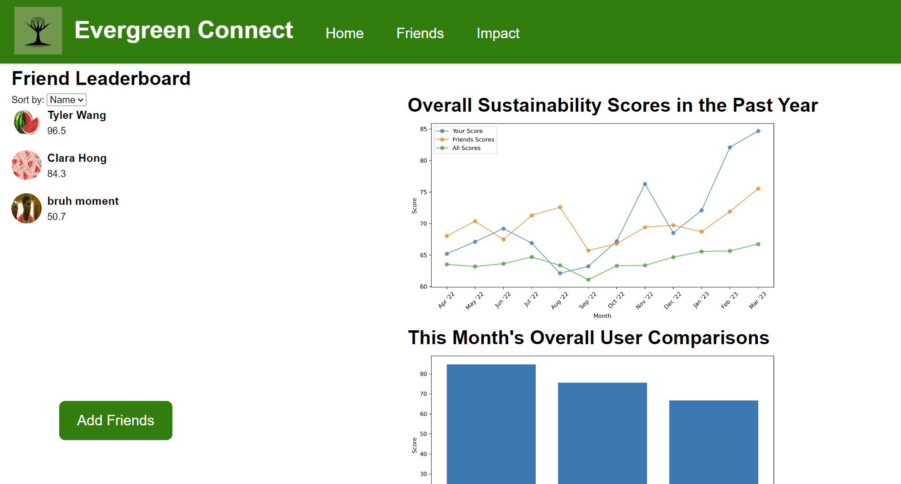

# HackTech 2023 | EvergreenConnect

**Authors** (in no particular order): Cynthia Chen, Maggie Sui, Evan Wang

EvergreenConnect is a website/app (proposed for HackTech 2023) that tracks aspects of your sustainability from utilities, consumption, and donations. This is all summarized within a succinct metric, the "sustainability score," in order to easily compare with friends and people all over the world.

With the addition of a social aspect, we aim to incentivize individuals to value choosing sustainable actions through friendly competition.

## Prototype

`index.html` is the home page of the website.

`graphs.ipynb` was used to generate plots for figures.

## Screenshots

Below we include screenshots of important pages:

 
We hope you enjoy!
